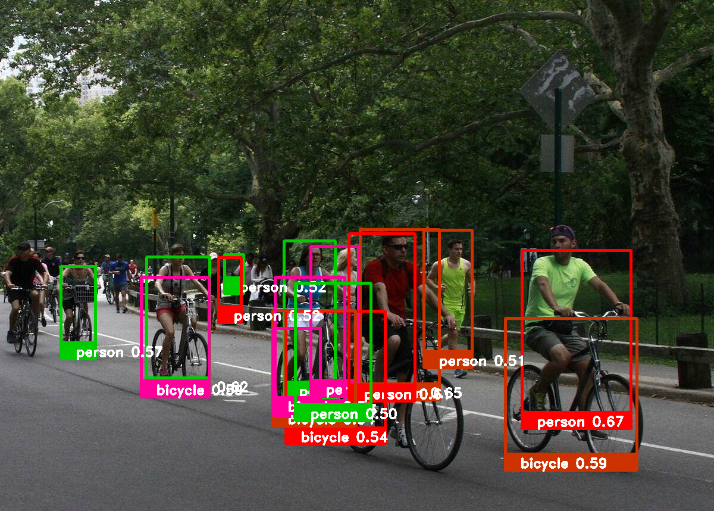
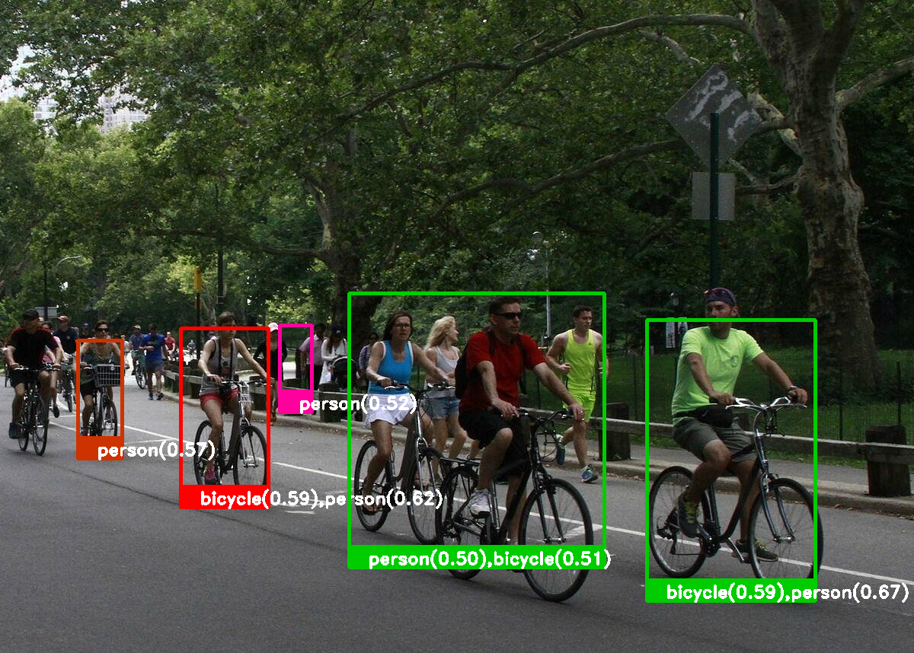
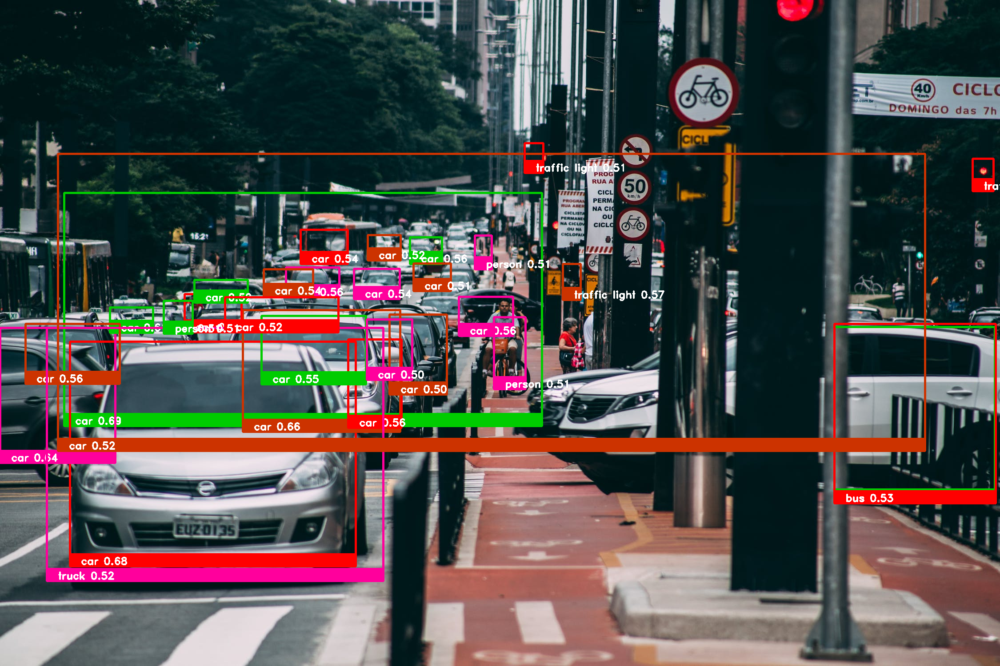
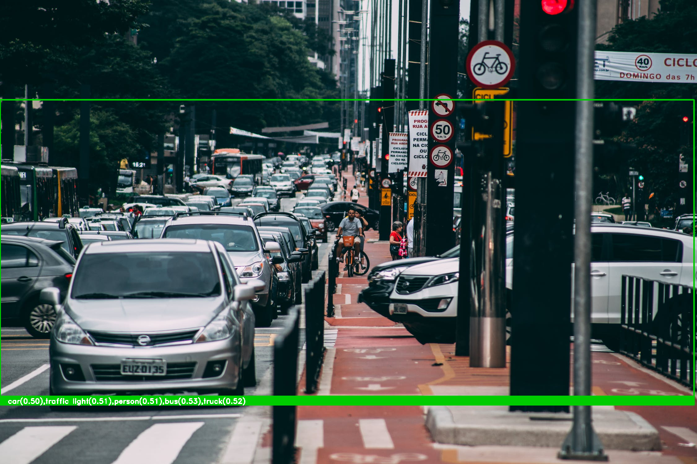
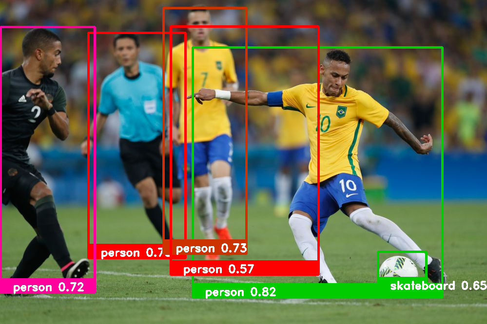
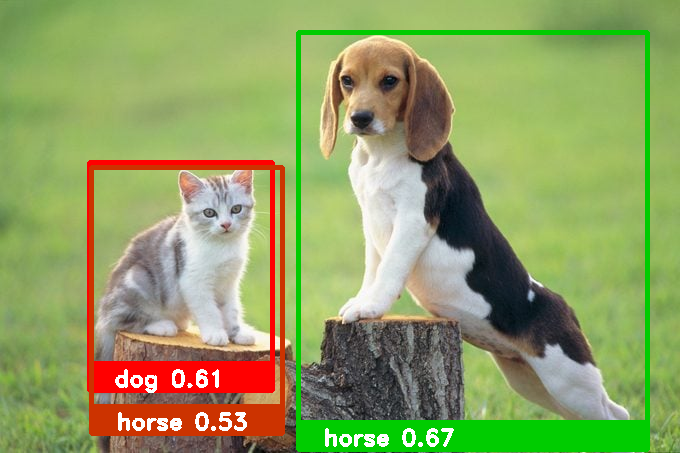

# Detecção de Objetos

- **Título**: Identificação de Objetos em Imagens e Vídeos
- **Alunos**:
  - Alan Duda dos Santos
  - José Ytalo Ramon de Almeida Gonçalves
- **Disciplina**: Visão Computacional (VC) - 2022.2
- **Professor**: Tácito Trindade de Araújo Tiburtino Neves
- **Código-Font**:
  - **Colab**: <https://colab.research.google.com/drive/1-EtKYzO9s0CpFUQUF3HgwlCkIvt2Q5Ys?usp=sharing>
  - **Github**: <https://github.com/jytaloramon/vc-2023-object-detection>

## Galeria

### Imagens

#### Central Park

#### Via (Tráfego)

#### Carro

#### Neymar

#### Animais

### Vídeos

#### MARQUETTI MKT

#### Aero - Por Trás da Aviação

## Conjunto Dados (Rede Neural)

1. Arquivo de rótulos (labels), de extensão .txt. Usado o COCO, link: https://github.com/zafarRehan/object_detection_COCO/blob/main/labels.txt.
2. Arquivo binário de treinamento contendo a topologia e os pesos da rede treinada, esse arquivo possui a extensão .pb (protobuf). Usado “MobileNet-SSD v3.pb”, link: http://download.tensorflow.org/models/object_detection/ssd_mobilenet_v3_large_coco_2020_01_14.tar.gz.
3. Arquivo de configuração da rede como formato .pbtxt (protobuf Text). Usado “ssd_mobilenet_v3_large_coco_2020_01_14.pbtxt”, link: https://gist.github.com/dkurt/54a8e8b51beb3bd3f770b79e56927bd7.
