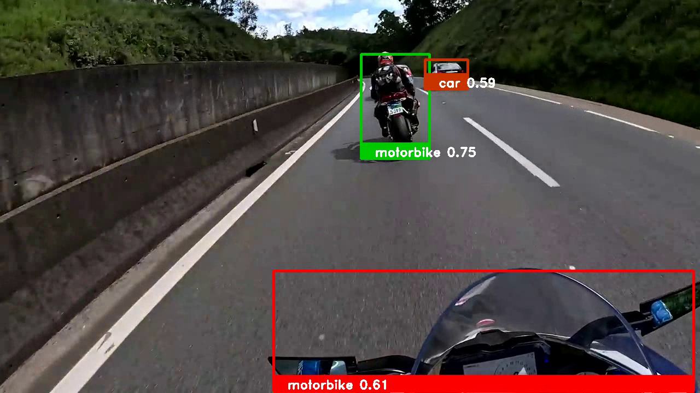

# Detecção de Objetos

- **Título**: Identificação de Objetos em Imagens e Vídeos
- **Alunos**:
  - Alan Duda dos Santos
  - José Ytalo Ramon de Almeida Gonçalves
- **Disciplina**: Visão Computacional (VC) - 2022.2
- **Professor**: Tácito Trindade de Araújo Tiburtino Neves
- **Código-Font**:
  - **Colab**: <https://colab.research.google.com/drive/1-EtKYzO9s0CpFUQUF3HgwlCkIvt2Q5Ys?usp=sharing>
  - **Github**: <https://github.com/jytaloramon/vc-2023-object-detection>

## Sumário

- [Detecção de Objetos](#detecção-de-objetos)
  - [Sumário](#sumário)
  - [Galeria](#galeria)
    - [Imagens](#imagens)
      - [Central Park](#central-park)
      - [Via (Tráfego)](#via-tráfego)
      - [Carro](#carro)
      - [Neymar](#neymar)
      - [Animais](#animais)
    - [Vídeos](#vídeos)
      - [MARQUETTI MKT](#marquetti-mkt)
      - [Aero - Por Trás da Aviação](#aero---por-trás-da-aviação)
  - [Conjunto Dados (Rede Neural)](#conjunto-dados-rede-neural)
  - [Referências](#referências)

## Galeria

### Imagens

#### Central Park

*Figura: Central Park, imagem de entrada.*

*Figura: Central Park, imagem de saída.*

*Figura: Central Park, imagem de saída com supressão.*

 

#### Via (Tráfego)

*Figura: Via (Tráfego), imagem de entrada.*

*Figura: Via (Tráfego), imagem de saída.*

*Figura: Via (Tráfego), imagem de saída com supressão.*

 

#### Carro

*Figura: Carro, imagem de entrada.*

*Figura: Carro, imagem de saída.*

 

#### Neymar

*Figura: Neymar (Futebol), imagem de entrada.*

*Figura: Neymar (Futebol), imagem de saída.*

 

#### Animais

*Figura: Animais, imagem de entrada.*

*Figura: Animais, imagem de saída.*

**Obs**.: erro de predição.

 

----
### Vídeos

#### MARQUETTI MKT

Vídeo Original: <https://youtu.be/dx7hI03spmg>

*Figura: MKT, vídeo de entrada.*

*Figura: MKT, vídeo de saída.*

*Figura: MKT, vídeo de saída com supressão.*

 

#### Aero - Por Trás da Aviação

Vídeo Original: <https://www.youtube.com/watch?v=mhz3NBcHSEA>

*Figura: Aero, vídeo de entrada.*

*Figura: Aero, vídeo de saída.*

## Conjunto Dados (Rede Neural)

1. Arquivo de rótulos (labels), de extensão .txt. Usado o COCO, link: https://github.com/zafarRehan/object_detection_COCO/blob/main/labels.txt.
2. Arquivo binário de treinamento contendo a topologia e os pesos da rede treinada, esse arquivo possui a extensão .pb (protobuf). Usado “MobileNet-SSD v3.pb”, link: http://download.tensorflow.org/models/object_detection/ssd_mobilenet_v3_large_coco_2020_01_14.tar.gz.
3. Arquivo de configuração da rede como formato .pbtxt (protobuf Text). Usado “ssd_mobilenet_v3_large_coco_2020_01_14.pbtxt”, link: https://gist.github.com/dkurt/54a8e8b51beb3bd3f770b79e56927bd7.

----

## Referências

- KURTAEV, Dmitry; SHABUNIN, Maksim; SANCTUS, Lupus. TensorFlow Object Detection API. [S. l.], 29 jan. 2018. Disponível em: https://github.com/opencv/opencv/wiki/TensorFlow-Object-Detection-API. Acesso em: 13 maio 2023.

- MALLICK, Satya. Deep Learning with OpenCV DNN Mopencvodule: A Definitive Guide. [S. l.], 2021. Disponível em: https://learnopencv.com/deep-learning-with-opencvs-dnn-module-a-definitive-guide/#what-is-opencvv-dnn-module. Acesso em: 13 maio 2023

- OPENCVTEAM. About. [S. l.], 13 maio 2023. Disponível em: https://opencv.org/. Acesso em: 13 maio 2023.

- ZAFAR, Rehan. Object Detection. [S. l.], 25 dez. 2021. Disponível em: https://github.com/zafarRehan/object_detection_COCO#readme. Acesso em: 13 maio 2023.
